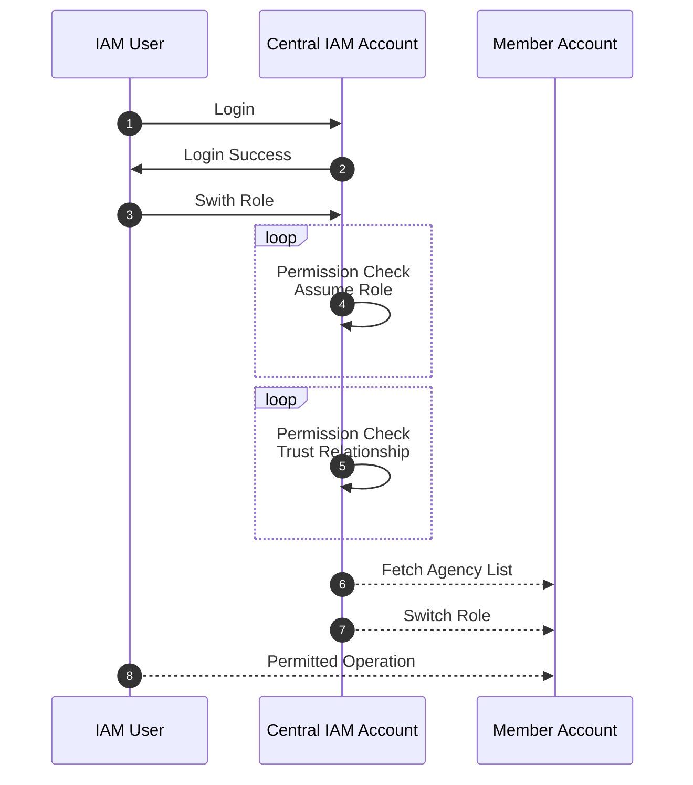
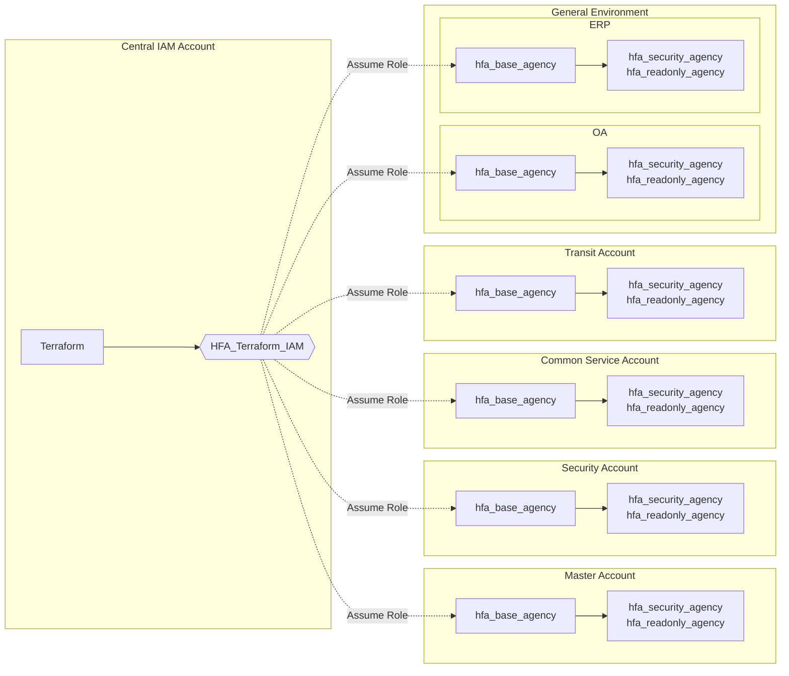

# Excution Sequence
1. ```terraform init -backend-config=obs.tfbackend```
# Central IAM Account Settings
Currently there is no native SSO service with centralized permission management on Huawei Cloud, So Central IAM account is responsible for access control.

The following diagram illustrates the authentication and access process:



This terraform configuration and guidance here would do the following two things:

* [Account Initialization](#account-initialization---manually-operations)
* IAM Resource Management


# Prerequisites

* All member accounts have joined the Organization

# Account Initialization - Manually Operations
Ideally all member accounts should be automatically created and initialized, but it doesn't supported by Huawei Cloud, So Accounts need to be manually created and initialized at the time of this writing(July 2023). The Terraform implementation is trying to minimize the efforts of creating and initializing member accounts and provide a path to full automation in the future. 

After account is created, the following operations need to be done in order:
1. Setting up MFA for every Huawei Cloud account
2. Creating HFA IAM agency in every account except Central IAM account delegating IAM permission to Central IAM account
3. Creating OBS bucket in Central IAM account to store Terraform state file
4. Creating an IAM user with Programmatic access for Terraform, The user is only allowed to read/write to a specific key in the OBS bucket and assume HFA agency in other HFA accounts
5. Locking up Huawei Cloud Account and don't use it for daily operation
6. Modifying and applying this terraform configuration according to customized HFA for specific customer

## HFA IAM Agency
Though it can not be created automatically at this moment, The HFA IAM Agency(except customer has naming conventions otherwise named `HFA_Terraform_IAM`) is the cornerstone of HFA Terraform implementation. The `HFA_Terraform_IAM` agency in every accounts except Central IAM Account would delegate necessary permission for creating IAM resources to Cental IAM account so this terraform configuration could use credential from Central IAM Account to create all necessary agencies and roles required by HFA.

The `HFA_Terraform_IAM` agency in every member accounts except security account will contains the following policy:

* Security Administrator

For the security account, because we need to configure CTS manually for all the HFA accounts, so we need to 
Though this configuration is mainly for IAM resources, but some resources in the security account are important and created in this configuration is more convenient and reasonable.

The obs bucket in security account will be created in this module. so `HFA_Terraform_IAM` agency in security account will have the following additional policy so the obs bucket can be created.

```
{
    "Version": "1.1",
    "Statement": [
        {
            "Effect": "Allow",
            "Action": [
                "obs:bucket:Get*",
                "obs:bucket:List*",
                "obs:bucket:Put*",
                "obs:bucket:HeadBucket",
                "obs:bucket:CreateBucket"
            ]
        }
    ]
}
```

You can create a additional policy and attach it to the `HFA_Terraform_IAM` agency or you can merge it into the common policy mentioned above.

## Terraform State Backends
There are five available options for Terraform backends on Huawei Cloud, Please choose appropriate one according to customer scenarios.

| Backends |  State Lock  | scenarios |
| :------: | :----------: | :-------: |
| local    |  No          | Test      |
| OBS      | No           | Production with caution |
| pg       | Yes          | Production |
| Consul   | Yes          | Production |
| Kubernetes | Yes        | Production |

The default backend for this terraform configuration is OBS. A private OBS bucket is required before proceeding.

## HFA Terraform User
In order to create IAM resources in other accounts and coordinate HFA implementation, A user with permission to assume `HFA_Terraform_IAM` agency, access OBS bucket and create IAM resources in Central IAM Account is required. 

For this terraform configuration, because mixed global service with project level service in the same policy document is not allowed, so create a user within a user group with the following two policies:

* Policy that allow the user to create IAM resources in Central IAM Account and store Terraform state in the OBS bucket

```
{
    "Statement": [
        {
            "Action": [
                "iam:agencies:*",
                "iam:tokens:assume",
                "iam:groups:*",
                "iam:credentials:*",
                "iam:identityProviders:*",
                "iam:mfa:*",
                "iam:permissions:*",
                "iam:projects:*",
                "iam:quotas:*",
                "iam:roles:*",
                "iam:policies:*",
                "iam:users:*",
                "iam:securitypolicies:*"
            ],
            "Effect": "Allow"
        },
        {
            "Effect": "Allow",
            "Action": [
                "obs:object:GetObject",
                "obs:bucket:GetBucketLocation",
                "obs:object:DeleteObject",
                "obs:object:PutObject",
                "obs:object:ModifyObjectMetaData",
                "obs:object:GetObjectVersion"
            ],
            "Resource": [
            # replace the bucket name "hfa-state" with customer's bucket
                "OBS:*:*:object:hfa-state/centraliam/terraform.tfstate"
            ]
        }
    ],
    "Version": "1.1"
}
```

* Server-Side Encryption for OBS bucket is recommended, attache this policy to allow use KMS service

```
{
    "Version": "1.1",
    "Statement": [
        {
            "Effect": "Allow",
            "Action": [
                "kms:dek:encrypt",
                "kms:cmk:getMaterial",
                "kms:cmk:create",
                "kms:grant:retire",
                "kms:cmk:getRotation",
                "kms:cmkTag:create",
                "kms:cmk:decrypt",
                "kms:partition:create",
                "kms:cmk:update",
                "kms:cmk:get",
                "kms:dek:create",
                "kms:partition:list",
                "kms:partition:get",
                "kms:grant:revoke",
                "kms:cmk:encrypt",
                "kms:cmk:getQuota",
                "kms:cmk:list",
                "kms:cmk:getInstance",
                "kms:cmk:generate",
                "kms:cmk:verify",
                "kms:cmk:crypto",
                "kms:cmk:sign",
                "kms:dek:crypto",
                "kms:dek:decrypt",
                "kms:grant:create",
                "kms:grant:list",
                "kms:cmk:deleteMaterial",
                "kms:cmk:getPublicKey",
                "kms:cmkTag:list",
                "kms:cmk:enable"
            ]
        }
    ]
}
```


# Apply Terraform Configuration 
After the account initialization, Use credential from user created in [HFA Terraform User](#hfa-terraform-user) to apply this terraform configuration.

## Inputs

The following inputs for this terraform configuration are required, change the terraform.tfvars per customer environment or provide those input through terraform commandline parameters.


<table>
    <tr>
        <th>Variable Name</th><th>Default Value</th><th>Comments</th>
    </tr>
    <tr>
        <th>HFA_Security_Account</th><th>/</th><th>Security accounts for storing security logs and managing some security services</th>
    </tr>
    <tr>
        <th>HFA_IAM_Account</th><th>/</th><th>Control access to all Huawei Cloud Accounts in the Organization </th>
    </tr>
    <tr>
        <th>HFA_Common_Account</th><th>/</th><th>Host all common services like AD, backeup etc.</th>
    </tr>
    <tr>
        <th>HFA_Transit_Account</th><th>/</th><th>Host basic networking service to facilitate network communication across HFA</th>
    </tr>
    <tr>
        <th>HFA_App_Account</th><th>/</th><th>Isolated environment for different business, if there are multiple isolated environments requirements, copying and modifying account based terraform files</th>
    </tr>
    <tr>
        <th>HFA_Master_Account</th><th>/</th><th>Master account also need to be managed but with least permission possible</th>
    </tr>
</table>


## 
This configuration needs to access all accounts under HFA to create neccessary users and policies, due to the current limitations of Huawei Cloud, there are challenges regarding providing credentials securely, choose one of the following recommendations according to customers' security requirements.

    * 

# Things that shouldn't be changed
## Terraform OBS Backend Key
key should be keep as "centraliam/terraform.tfstate"

# Limitations

## 
## Supported Agency Type
Only if the type of agency is Account is supported, can not create an agency to delegate permission to another cloud service.
* CTS: when CTS is enabled at first time, Huawei Cloud will create a agency named `cts_admin_trust`
##
Newly created account only contains limited projects in specific region, you may need to switch to other region required by terraform configurations to create default project.


##
