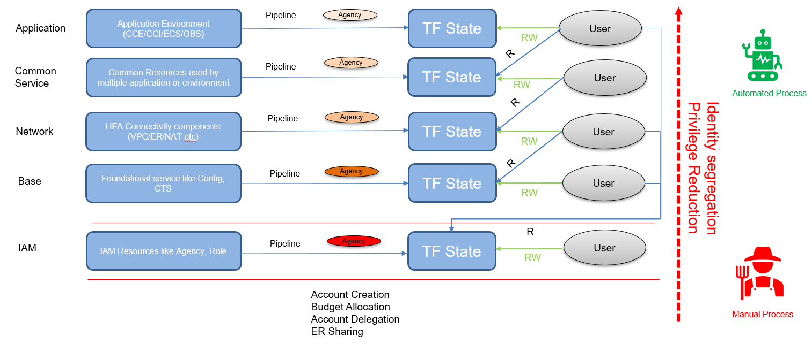

# HFA Reference Implementation

HFA is a well-architected, multi-account Huawei Cloud environment that  is a starting point from which you can deploy workloads and applications. It provides a baseline to get started with multi-account architecture, identity and access management, governance, data security, network design, and logging.

HFA follows key design principles across different design areas which accommodate all application portfolios and enable application migration, modernization, and innovation at scale.

This is reference implementation of Huaweicloud HFA for workshop purpose, this implementation will initialize the following accounts in HFA:
* Centralized IAM Account
* Common Services Account
* Transit Account
* Security Account
* Production Account(workloads)

:high_brightness: In HFA, the master account also need to be initialized to implement security baseline and delegate some organization responsibilities to other accounts, Due to the accounts limitations of a guided workshop, this implementation won't do anything to the master account, but budget will be allocated in advance to member accounts.

# Procedures To Terraform HFA Implementation
Implementing all HFA elements with Terraform at this stage is not possible because of service limitations. In terms of security, identity segregation and least privilege are necessary. we follow the hierarchy below to implement HFA on Huawei Cloud.

you need to follow the following steps precisely to accomplish the goal.

## Security Account

The security account serves as the central account for security operation and archiving security related logs across HFA accounts. 

One OBS bucket in security account will be used to store all CTS system trace data that can only be accessed by security team out of security investigation and security operation purpose and by audit team for compliance reason.

For some enterprises, security operation relies on security solutions like SIEM, EASM, etc. The current HFA Terraform implementation does not including all those customized configurations, Please talk to customers and implement it in HFA-Security Level.

Due to the current limitations of Terraform Huawei Cloud provider, the security Account can not be configured entirely through Terraform. The following configurations need to be configured manually, please refer to [Security Account Configuration](./workshop/08_Security_Setup.md) for details.

* Enable CTS

For all other configurations that will be configured automatically, Please refer to [Security Account Terraform Implementation](./HFA-Security/Log.md#security-account)

