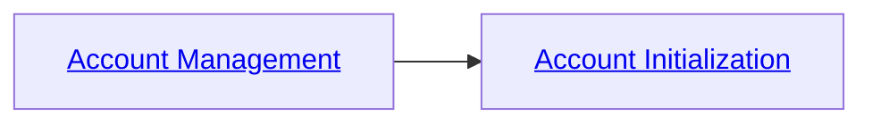

# Introduction 
This workshop demonstrates a typical HFA implementation on Huawei Cloud using Terraform, but at the time of this writing, an end-to-end and fully automated Terraform implementation is not possible because some cloud services and features of cloud service are not provide API for programatic access. 

We hope this workshop will help you gain the necessary knowledge about HFA and Terraform hands-on experiences to help customer build their Huawei Cloud environment following the best practices and state-of-art cloud management concepts.

# Goals

* Build a basic HFA environment
* Expanse the environment with confidence

# Target audience
This is a technical workshop helping customer build their Huawei Cloud HFA environment with Terraform. The participants should have experiences with Huawei Cloud and have basic knowledge of HFA.

# Prerequisites
Unless you participate a guided workshop, you will need to meet the requirements below to complete the workshop.

* A Huawei Cloud account - Master/Management Account
* 5 email addresses, one for each of the following Huawei Cloud accounts:
    * Centralized IAM account - The Account for managing access to HFA environment
    * Transit Account - where some core network services are deployed
    * Security Operation Account - where security related logs like CTS logs are stored and from where security services like SIEM might be managed
    * Common Services Account - where shared services are deployed
    * Application Account - where production workloads are deployed

you can use Plus Addressing to reduce the complexity of managing multiple email addresses. if your email address is `g@gmail.com`, you can use `g+iam@gmail.com` or `g+transit@gmail.com` to register with Huawei Cloud, all the addresses are valid and can reach the inbox of the `g@gmail.com`.

Whenever we mention a account with a conventional name in this workshop, you can map it to a account entity provided by the workshop facilitators. Please refer to the following table to log in to specific HFA member account to finish the hands-on lab accordingly.

| Account Name | Conventional Name |
| ------------- | ----------------- |
| ${prefix}_iam | Centralized IAM Account |
| ${prefix}_security | Security Operation Account |
| ${prefix}_transit | Transit Account |
| ${prefix}_common  | Common Services Account |
| ${prefix}_app     | Production Account |

# Modules
Following the sequence to implement HFA on Huawei Cloud

