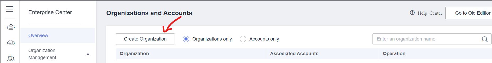
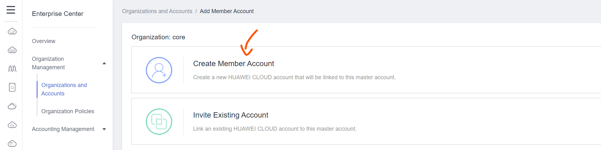
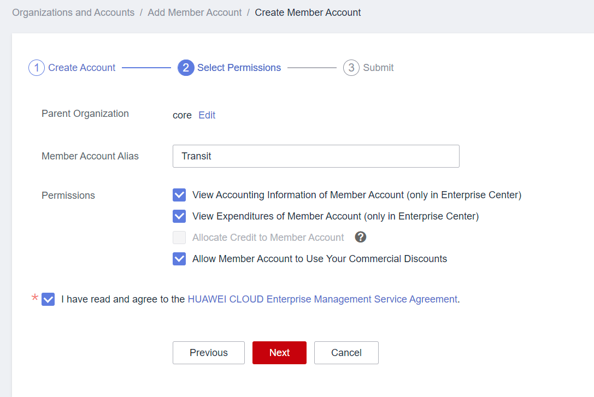
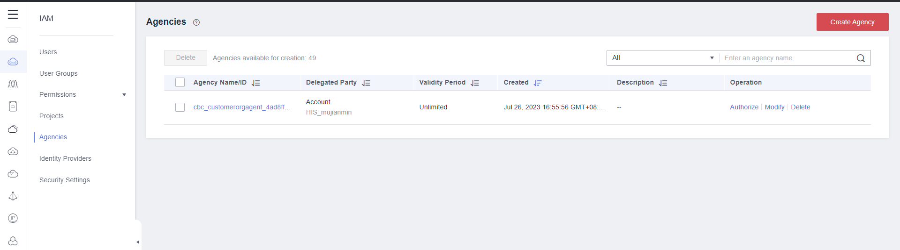
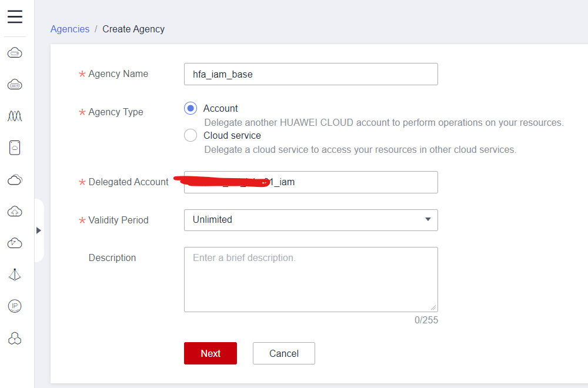
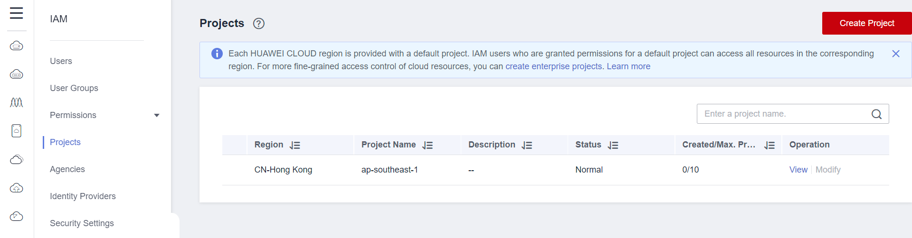

# Introduction
In this workshop, the following organization structure are designed for the customer to meet their business and governance requirements.

This is the foundation of this workshop, all the OUs and accounts have been created manually in advance. if you don't familiar with the process，you can go through the steps quickly.

# Tasks
## Create OUs
1. Login into Master Account
2. On the upper right corner of Huawei Cloud console, Choose "More" -> "Enterprise" -> "Organizations and Accounts"

3. Under `Organizations and Accounts`, choose `Create Organization`

4. Create the core OU first, choose the root level as the `Parent Organization`

5. Create the production OU,choose the root level as the `Parent Organization`

## Create Accounts
1. Login into Master Account
2. On the upper right corner of Huawei Cloud console, Choose "More" -> "Enterprise" -> "Organizations and Accounts"

3. On the `Organization Management` page, choose `Add member account` at the `Operation` column for a specific OU

4. On the new page, choose `Create Member Account`

5. Choose `Next`, provide the Account Name and Email Address

6. Choose `Next`, provide a alias for the to be created account and select the permission for managing your member account

7. Choose `Next`, check if all the information is correct, choose `Obtain Verification Code` to get the verification code send to the provided email address, once you get the verification code, enter the verification code and choose `Submit` to finish account creation process

8. Create all other accounts by repeating step 3 to 7

## Allocate Budget
Sufficient budget must be allocated to all the member accounts before starting to use any non-free services.

## Create `hfa_iam_base` Agency in HFA accounts
:hourglass: Team members can do this in different accounts simultaneously
1. Use Huawei Cloud Account log in to `Security Operation Account`
2. Choose `Service List` on the upper left corner of the console and Choose `Identify and Access Management`

3. Choose `Agencies` -> `Create Agency`

4. On the `Create Agency` page, provide the following parameters
   Agency Name: `hfa_iam_base` or names that conforms to your naming convention
   Agency Type: `account`
   Delegated Account: Centralized IAM Account(Provide the account name which has a `_iam` suffix)
   Validity Period: Unlimited

5. Choose `Next` and search and check `security administrator` in the search box

6. Choose `Next`, make sure the Scope is `All resources`

7. Choose `Next` to finish the agency creation
8. Choose `Projects` from left panel of IAM service

9. If there is no `ap-southeast-3` project exists, choose `Create Project` on the upper right corner of the page
10. On the project creation page, select `AP-Singapore` from the dropdown menu for `Region` parameter and then choose `Cancel`, you can see a project for Singapore region has been created

11. Create the same agency in all other member accounts except `Centralized IAM Account` by repeating step 1 to step 10

