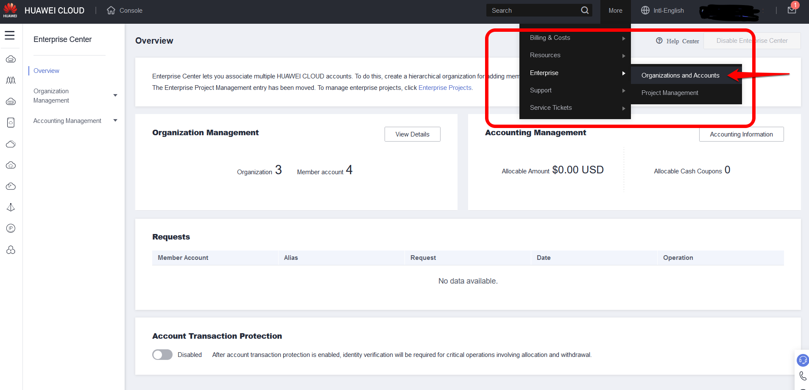
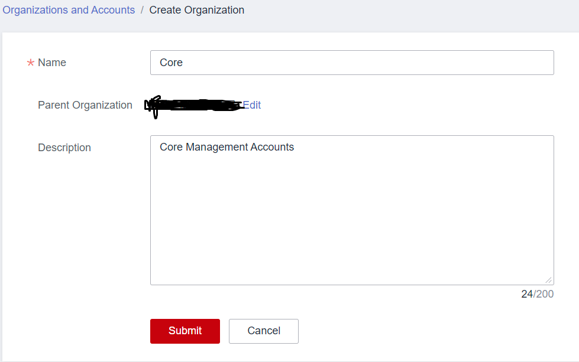
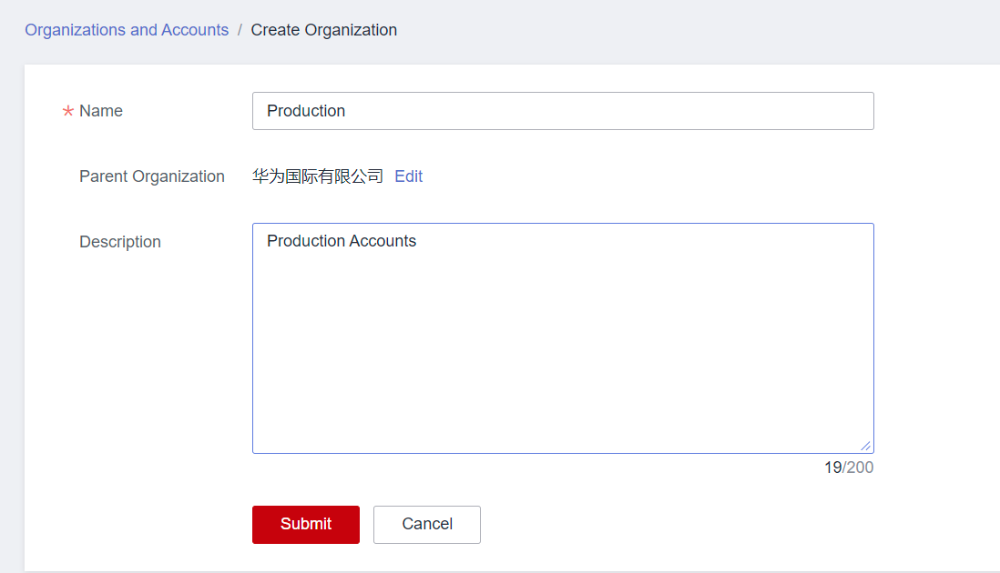
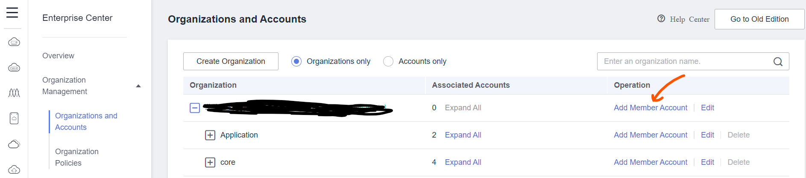
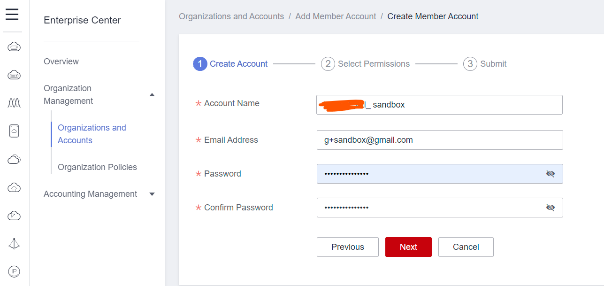
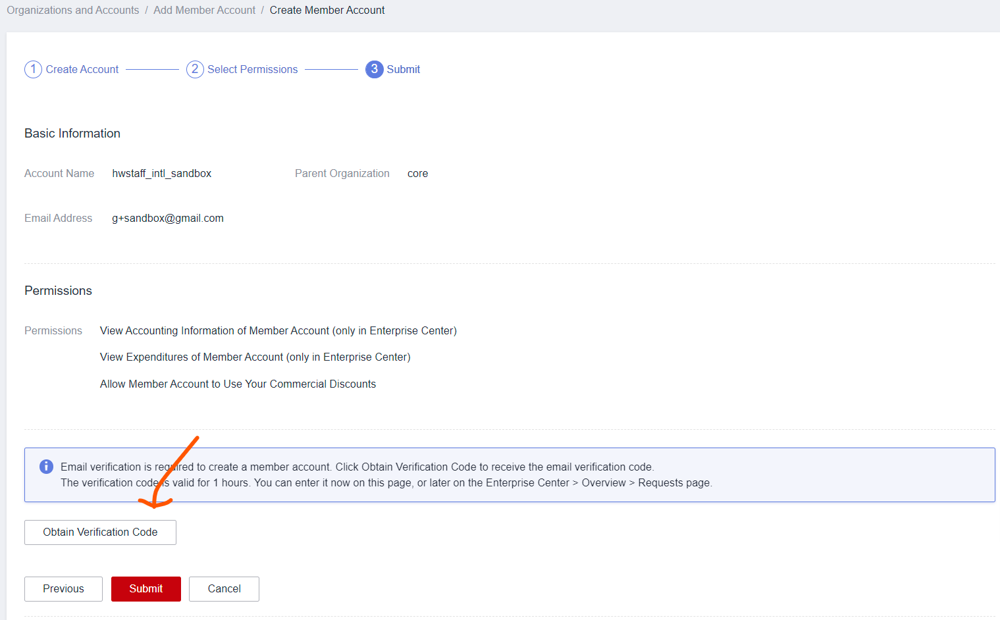

# Introduction
In this workshop, the following organization structure are designed for the customer to meet their business and governance requirements.

This is the foundation of this workshop, all the OUs and accounts must be created manually.

# Tasks
## Create OU
1. Login into Master Account
2. On the top panel of Huawei Cloud console, Choose "More" -> "Enterprise" -> "Organizations and Accounts"

3. Under `Organizations and Accounts`, choose `Create Organization`

4. Create the core OU first, choose the root level as the `Parent Organization`

5. Create the production OU,choose the root level as the `Parent Organization`

## Create Accounts
1. Login into Master Account
2. On the top panel of Huawei Cloud console, Choose "More" -> "Enterprise" -> "Organizations and Accounts"

3. On the `Organization Management` page, choose `Add member account` at the `Operation` field for a specific OU

4. On the new page, choose `Create Member Account`

5. Choose `Next`, provide the Account Name and Email Address as defined before

6. Choose `Next`, provide a alias for the to be created account and select the permission for managing your member account

7. Choose `Next`, check if all the information is correct, choose `Obtain Verification Code` to send a verification code to the provided email address, once you get the verification code, enter the verification code and choose `Submit` to finish account creation process

8. Create all other accounts by repeating step 3 to 7
