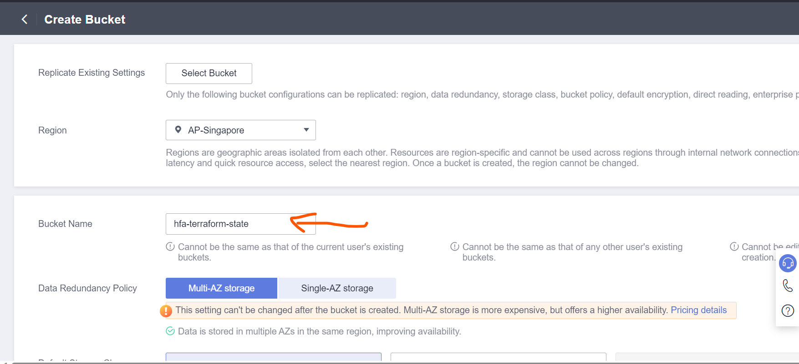
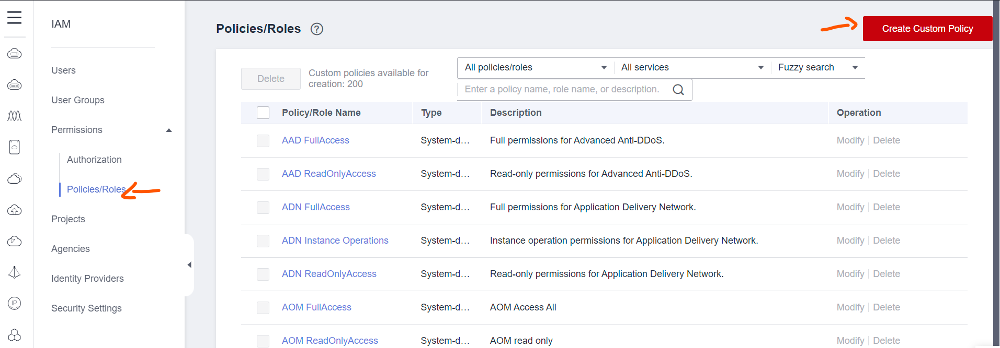

# Introduction
At this moment, we can not manipulate member accounts directly from master account, so a agency in every member account except `Centralized IAM Account` should be created manually in advance to allow Terraform access.

# Tasks
## Create `hfa_terraform` Agency in HFA accounts
:hourglass: Team members can do this in different accounts simultaneously
1. Use Huawei Cloud Account log in to `Security Operation Account`
2. Choose `Service List` on the top left corner of the console and Choose `Identify and Access Management`

3. Choose `Agencies` -> `Create Agency`

4. On the `Create Agency` page, provide the following parameters
   Agency Name: `hfa_terraform` or names that conforms to your naming convention
   Agency Type: `account`
   Delegated Account: `Centralized IAM Account`
   Validity Period: Unlimited

5. Choose `Next` and search and check `security administrator` in the search box

6. Choose `Next`, make sure the Scope is `All resources`

7. Choose `Next` to finish the agency creation
8. Choose `Projects` from left panel of IAM service

9. If there is no `ap-southeast-1` project exists, choose `Create Project` on the upper right corner of the page
10. On the project creation page, select `AP-Singapore` from the dropdown menu for `Region` parameter and then choose `Cancel`, you can see a project for Singapore region has been created


11. Create the same agency in all other member accounts except `Centralized IAM Account` by repeating step 1 to step 10

## Create a OBS bucket for terraform state storage
1. Use Huawei Cloud Account log in to `Centralized IAM Account`
2. Choose `Object Storage Service`
3. Choose `Create Bucket` on the upper left of the console
4. For the bucket parameters, change the following parameters, leave the other parameters as default
* Region: AP-Singapore
* Bucket Name: choose a name as you like
* Server-Side Encryption: SSE-KMS
* Encryption Key Type: default



## Create `hfa_terraform` User and User Group
1. Use Huawei Cloud Account log in to `Centralized IAM Account`
2. Choose `Service List` on the upper left corner of the console and Choose `Identify and Access Management`

3. Choose `Permissions` -> `Policies/Roles` -> `Create Custom Policy`

4. Create the `hfa_terraform` role by the following policy content to allow Terraform to create IAM resources in `Centralized IAM Account` and switch role to other accounts.

:warning: Need to change the `Resource` element of the second and third statement with the bucket you create in [Create a OBS bucket for terraform state storage](#create-a-obs-bucket-for-terraform-state-storage)
```
{
    "Statement": [
        {
            "Action": [
                "iam:agencies:*",
                "iam:tokens:assume",
                "iam:groups:*",
                "iam:credentials:*",
                "iam:identityProviders:*",
                "iam:mfa:*",
                "iam:permissions:*",
                "iam:projects:*",
                "iam:quotas:*",
                "iam:roles:*",
                "iam:policies:*",
                "iam:users:*",
                "iam:securitypolicies:*"
            ],
            "Effect": "Allow"
        },
        {
            "Effect": "Allow",
            "Action": [
                "obs:object:GetObject",
                "obs:object:DeleteObject",
                "obs:object:PutObject",
                "obs:object:ModifyObjectMetaData",
                "obs:object:GetObjectVersion"
            ],
            "Resource": [
            # replace the bucket name "hfa-terraform-state" with your bucket and delete this comment
                "OBS:*:*:object:hfa-terraform-state/hfa-iam/terraform.tfstate"
            ]
        },
        {
            "Action": [
                "obs:bucket:HeadBucket",
                "obs:bucket:ListBucket"
            ],
            "Effect": "Allow",
            # replace the bucket name "hfa-terraform-state" with your bucket and delete this comment
            "Resource": [
                "OBS:*:*:bucket:hfa-terraform-state"
            ]
        }
    ],
    "Version": "1.1"
}
```


5. Terraform need KMS permission to write and read object from OBS, so create `hfa-terraform-kms` policy with the following policy
```
{
    "Version": "1.1",
    "Statement": [
        {
            "Effect": "Allow",
            "Action": [
                "kms:dek:encrypt",
                "kms:cmk:getMaterial",
                "kms:cmk:create",
                "kms:grant:retire",
                "kms:cmk:getRotation",
                "kms:cmkTag:create",
                "kms:cmk:decrypt",
                "kms:partition:create",
                "kms:cmk:update",
                "kms:cmk:get",
                "kms:dek:create",
                "kms:partition:list",
                "kms:partition:get",
                "kms:grant:revoke",
                "kms:cmk:encrypt",
                "kms:cmk:getQuota",
                "kms:cmk:list",
                "kms:cmk:getInstance",
                "kms:cmk:generate",
                "kms:cmk:verify",
                "kms:cmk:crypto",
                "kms:cmk:sign",
                "kms:dek:crypto",
                "kms:dek:decrypt",
                "kms:grant:create",
                "kms:grant:list",
                "kms:cmk:deleteMaterial",
                "kms:cmk:getPublicKey",
                "kms:cmkTag:list",
                "kms:cmk:enable"
            ]
        }
    ]
}
```

6. Choose `User Groups` at the left panel of the console and Choose `Create User Group` at the upper right corner of the console

7. Create `hfa_terraform` user group

8. Choose the user group created in last step and assign the role create in step 4 and step 5 to the group


9. Create `hfa_terraform` and add it to the `hfa_terraform` user group, Please note that this user should only have `Programmatic access` to Huawei Cloud


:heavy_exclamation_mark: Please keep the downloaded credential safe
