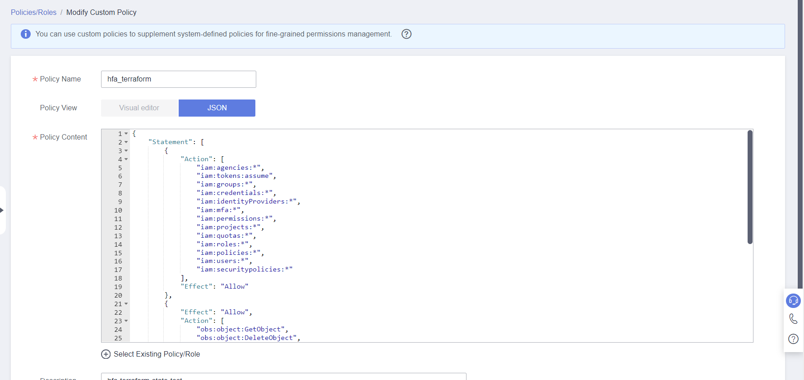

# Introduction
The purpose of this module is to establish the basic environment for applying HFA Terraform configurations. for this workshop, a OBS bucket is required for storing Terraform state file.

:information_source: If you are doing self-paced workshop, Please start from [Account Management](01_Account_Management.md)

If you are participating a workshop hosted by Huawei Professional Service Team, the facilitator has created the following resource for you.
* `hfa_iam_base` in every accounts to allow Terraform manage IAM resources
* `hfa_terraform_kms` in Centralized IAM account to allow Terraform access KMS service for encryption and decryption

# Tasks
## Create a OBS bucket as terraform backend
1. Log in to `Centralized IAM Account`
2. Choose `Object Storage Service`
3. Choose `Create Bucket` on the upper left of the console
4. For the bucket parameters, change the following parameters, leave the other parameters as default
* Region: AP-Singapore
* Bucket Name: choose a name as you like
* Server-Side Encryption: SSE-KMS
* Encryption Key Type: default


## Create `hfa_terraform` User and User Group
1. Use Huawei Cloud Account log in to `Centralized IAM Account`
2. Choose `Service List` on the upper left corner of the console and Choose `Identify and Access Management`

3. Choose `Permissions` -> `Policies/Roles` -> `Create Custom Policy`

4. Create the `hfa_terraform` role by the following policy content to allow Terraform to create IAM resources in `Centralized IAM Account` and switch role to other accounts.

:warning: Need to change the `Resource` element of the second and third statement with the bucket you create in [Create a OBS bucket for terraform state storage](#create-a-obs-bucket-for-terraform-state-storage)
```
{
    "Statement": [
        {
            "Action": [
                "iam:agencies:*",
                "iam:tokens:assume",
                "iam:groups:*",
                "iam:credentials:*",
                "iam:identityProviders:*",
                "iam:mfa:*",
                "iam:permissions:*",
                "iam:projects:*",
                "iam:quotas:*",
                "iam:roles:*",
                "iam:policies:*",
                "iam:users:*",
                "iam:securitypolicies:*"
            ],
            "Effect": "Allow"
        },
        {
            "Effect": "Allow",
            "Action": [
                "obs:object:GetObject",
                "obs:object:DeleteObject",
                "obs:object:PutObject",
                "obs:object:ModifyObjectMetaData",
                "obs:object:GetObjectVersion"
            ],
            "Resource": [
            # replace the bucket name "hfa-terraform-state" with your bucket and delete this comment
                "OBS:*:*:object:hfa-terraform-state/hfa-iam/terraform.tfstate"
            ]
        },
        {
            "Action": [
                "obs:bucket:HeadBucket",
                "obs:bucket:ListBucket"
            ],
            "Effect": "Allow",
            # replace the bucket name "hfa-terraform-state" with your bucket and delete this comment
            "Resource": [
                "OBS:*:*:bucket:hfa-terraform-state"
            ]
        }
    ],
    "Version": "1.1"
}
```


5. Choose `User Groups` at the left panel of the console and Choose `Create User Group` at the upper right corner of the console

6. Create `hfa_terraform` user group
  

7. Choose the user group created in last step and assign the role create in step 4 and step 5 to the group


8. Create `hfa_terraform` user and add it to the `hfa_terraform` user group, Please note that this user should only have `Programmatic access` to Huawei Cloud


:heavy_exclamation_mark: Please keep the downloaded credential safe
