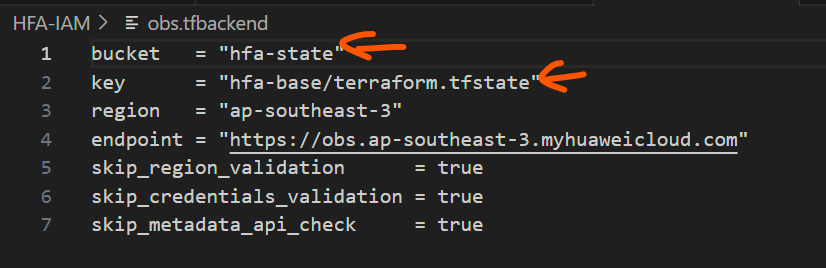
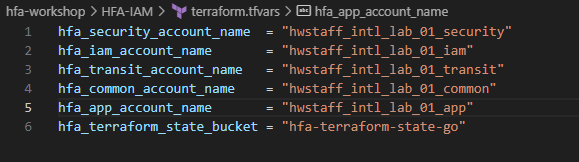
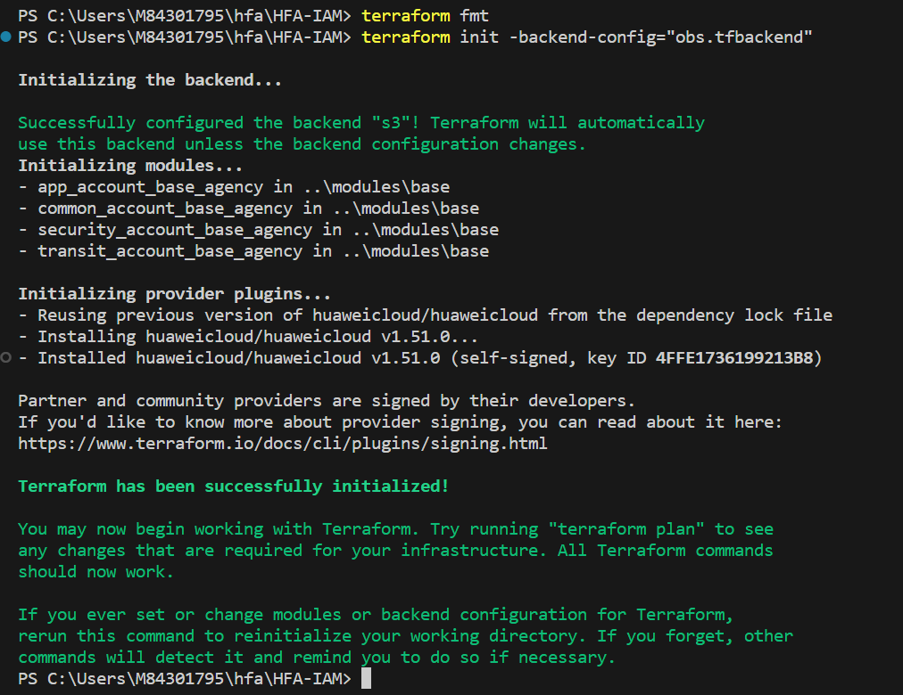
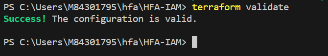
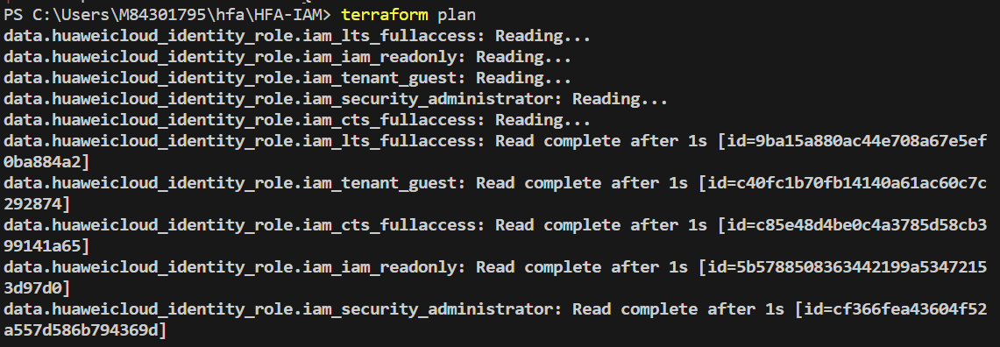
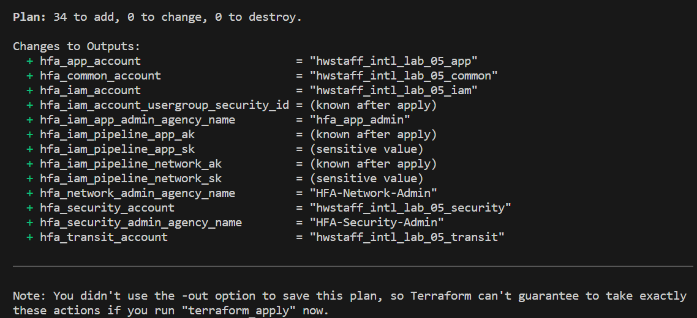
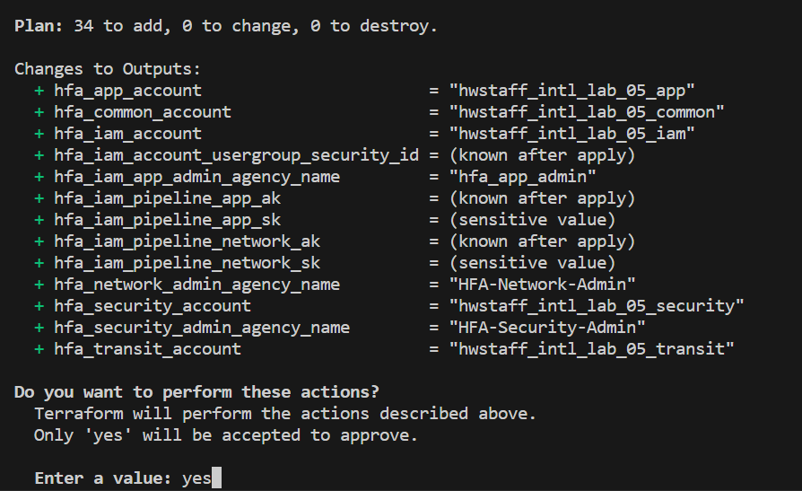

# Introduction
IAM resources is the foundation of the HFA implementation, it need to be created first first.

# Tasks
## Clone HFA Repository
1. open you shell or powershell/cmd to clone the HFA terraform example configurations
```
git clone https://github.com/Huawei-APAC-Professional-Services/hfa.git
```

## Configure Environment Variables
1. Configure environment variables using the `hfa_terraform` user that you created in [Account Initialization](02_Account_Initialization.md#create-hfa_terraform-user-and-user-group), you can follow the instruction in [Loca Environment Setup](./03_Local_Env_Setup.md#configure-environment-variables) to configure both sets of environment variables using the same credentials

:hammer_and_wrench: The credentials will allow terraform to access Huawei Cloud and read/write the state file with name you designated when you createe the policy for `hfa_terraform` group

2. check if the following environment variables exist
* AWS_ACCESS_KEY_ID
* AWS_SECRET_ACCESS_KEY
* AWS_DEFAULT_REGION
* HW_ACCESS_KEY
* HW_SECRET_KEY
* HW_REGION_NAME

Use the following commands to check environment variables on different platform:
* Linux/MacOS: env
* Windows CMD: set
* Windows Powershell: gci/dir env:

## Modify and Apply terraform configuration
1. Change to  `hfa/HFA-IAM` directory
2. Open `obs.tfbackend` file to configure terraform backend
3. Change the `bucket` parameters to the name of the bucket that you created in the [hfa_terraform bucket](./02_Account_Initialization.md#create-a-obs-bucket-for-terraform-state-storage)
(For simplicity, Just change the `bucket` parameter, if you change the key, you need to change some the configurations in other modules)
4. Open `terraform.tfvars` file to configure input variables
5. Change the value of the variables in this file. all the parameters ending with `_key` can be customized as you like, but must be consistent with backend configuration of every module

6. Initialize Terraform configuration by executing the following command. `terraform fmt` wiil rewrite all Terraform configuration files to a canonical format. `terraform init` will initialize a new or existing Terraform working directory by creating
  initial files, loading any remote state, downloading modules, etc
```
terraform fmt
terraform init -backend-config="obs.tfbackend"
```

7. Execute `terraform validate` command to validate the configuration files
  

8. Execute `terraform plan` to show what actions Terraform would take to apply the current configuration



9. Execute `terraform apply` to apply the configuration to Huawei Cloud, normally, we will use generated plan from step 8 to make sure the consistency. The command will give you prompt to confirm the action, please enter `yes`

10. After a successful terraform apply, you will get all the outputs for the future use, there is no need to save the output, we can query all the output at any time

