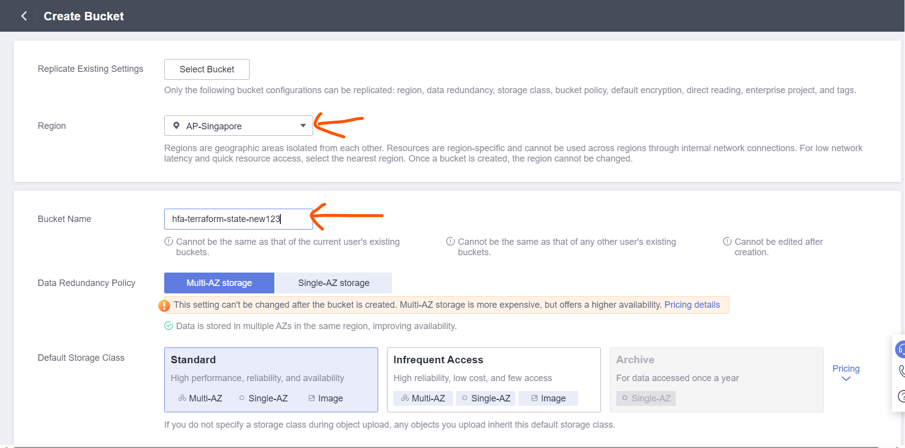
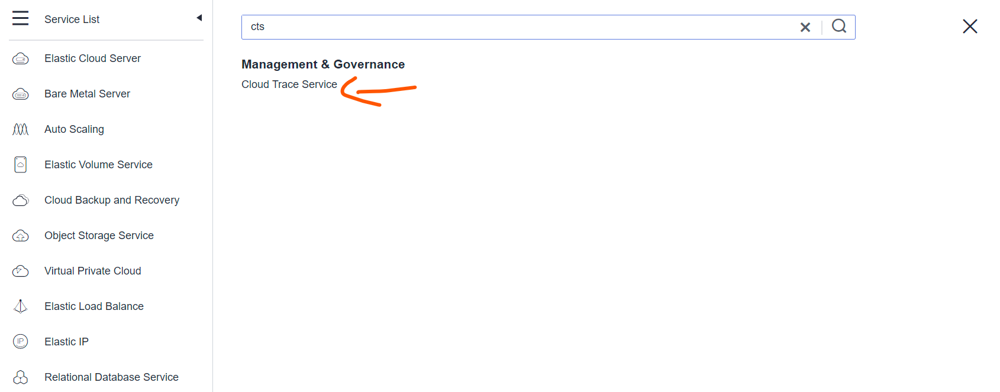
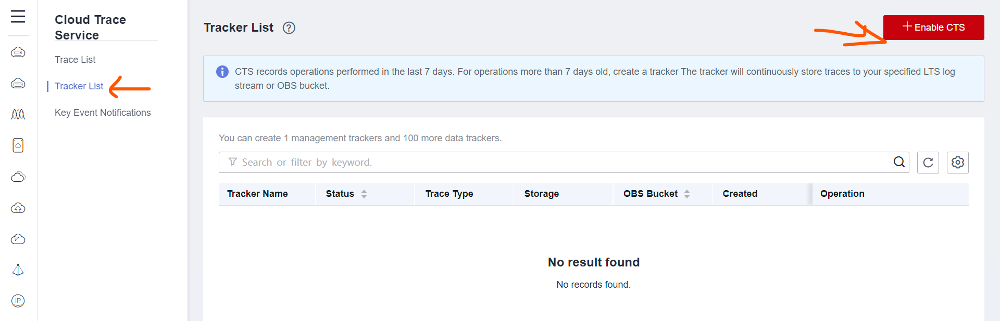
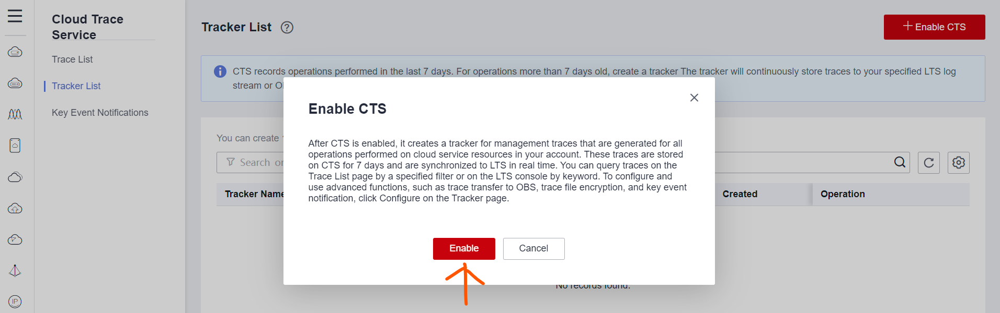
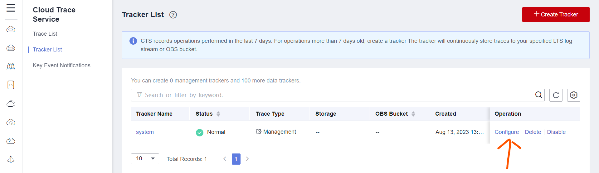
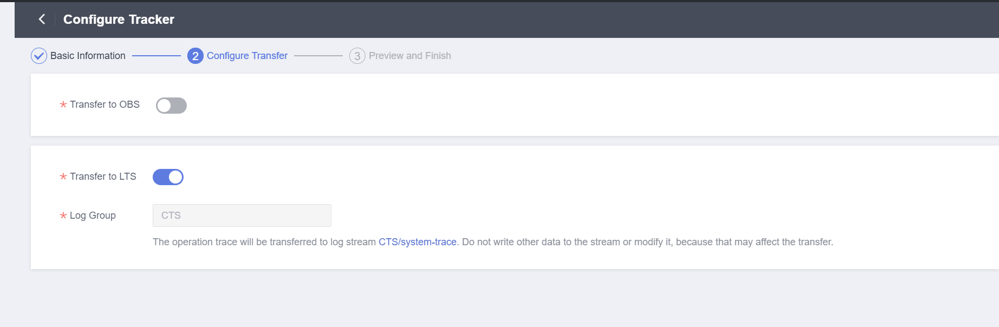
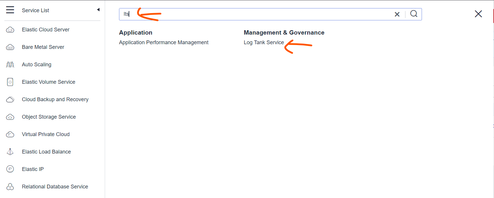
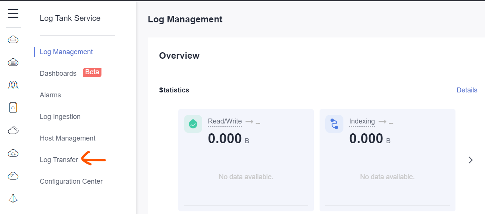
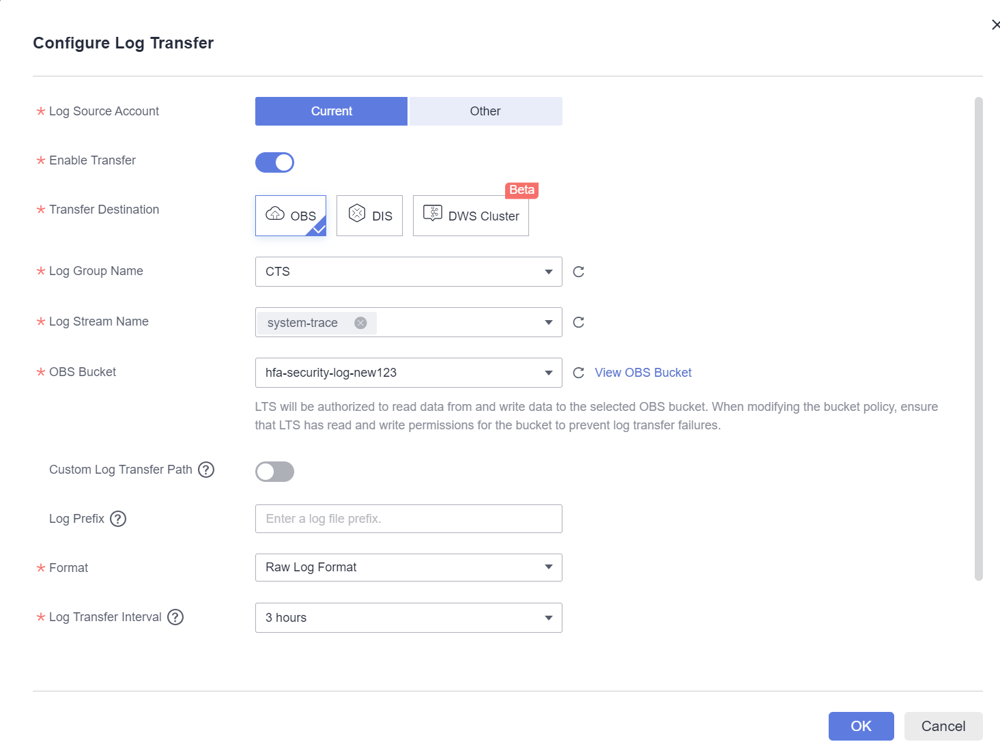
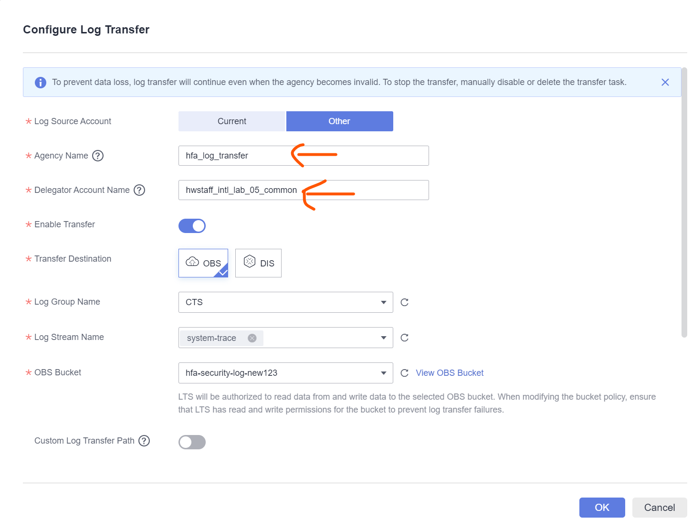

# Introduction
Currently due to the limitations of IAM, OBS does not support creating bucket from another account by switching role, so the bucket for centralized logging must be created manually. in the future, if iam allowed assumed role to create the OBS bucket, the bucket can be imported to terraform state.

# Tasks
## Create OBS bucket in `Security Operation Account` for central logging
1. Log in to `Security Operation Account` using Huawei Cloud account credential
2. From `Service List`, select `Object Storage Service` and choose `Create Bucket`
3. On the creation page,  select `AP-Singapore` as the region, and provide a uniq name, for the workshop, the default value for the rest parameters is sufficient.

## Enable CTS in `Security Operation Account`
1. Log in to `Security Operation Account` using Huawei Cloud account credential
2. From `Service List`, search `cts` and choose `Cloud Trace Service`

3. On the left side panel of `Cloud Trace Service`, Choose `Tracker List` and Click `+Enable CTS` on the top right corner of the page

4. On the Pop-up browser window, choose `Enable`

5. After the system tracker is created， Choose `Configure` under the `Operation` column

6. In the configuration, change the configuration to allow CTS transfer log to the LTS

7. From `Service List`, search `lts` and choose `Log Tank Service`

8. On the left side panel of `Log Tank Service`, Choose `Log Transfer`

9. Choose `Configure Log Transfer` on the upper right corner of the console
10. Configure Log Transfer to transfer cts log to the bucket created in 

## Enable CTS in other accounts
1. Log in to `Centralized IAM Account`, `Transit Account`, `Common Services Account` and `Production Account` to do the following configuration separately
2. From `Service List`, search `cts` and choose `Cloud Trace Service`

3. On the left side panel of `Cloud Trace Service`, Choose `Tracker List` and Click `+Enable CTS` on the top right corner of the page

4. On the Pop-up browser window, choose `Enable`

5. After the system tracker is created， Choose `Configure` under the `Operation` column

6. In the configuration, change the configuration to allow CTS transfer log to the LTS

## Transfer CTS Log to `Security Operation Account`
1. Log in to `Security Operation Account` using Huawei Cloud account credential
2. From `Service List`, search `lts` and choose `Log Tank Service`

3. On the left side panel of `Log Tank Service`, Choose `Log Transfer`

4. Choose `Configure Log Transfer` on the upper right corner of the console
5. In the configuration page, configure the parameters as following:
* Agency Name: `hfa_log_transfer`
* Delegator Account Name: member accounts of this organization
* Enable Transfer: true
* Transfer Destination: OBS
* Log Group Name: CTS
* Log Stream Name: system-trace
* OBS Bucket: Name of the bucket created in 

6. Repeat step 4 to step 5 until all member accounts have been configured