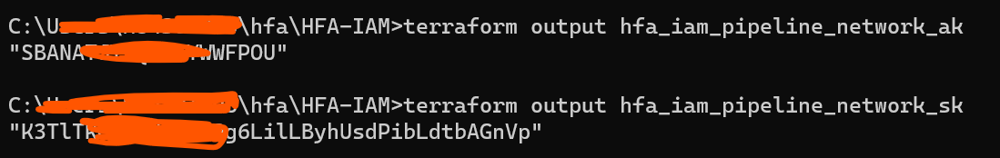
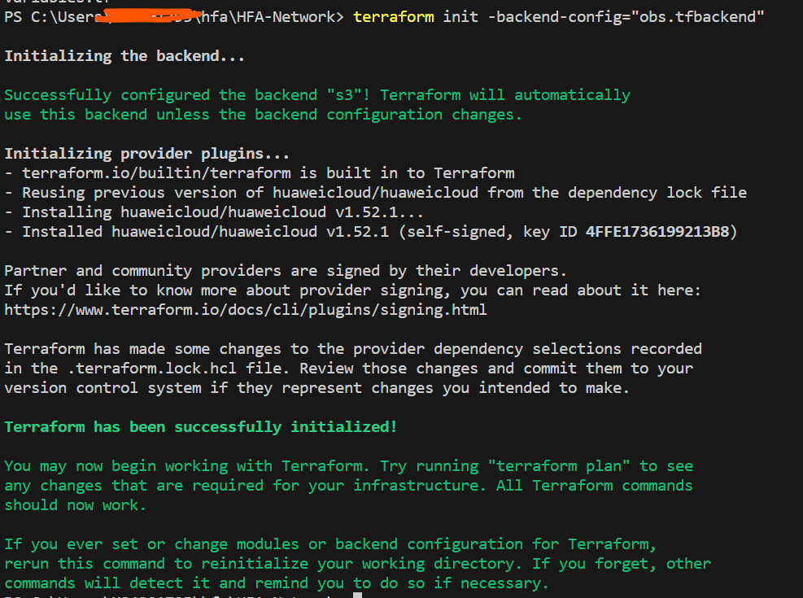
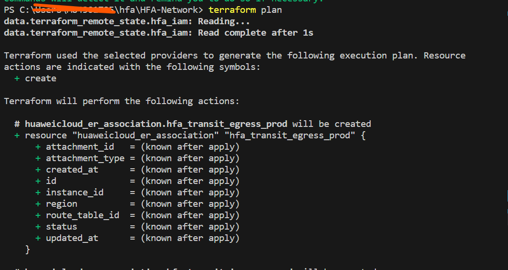
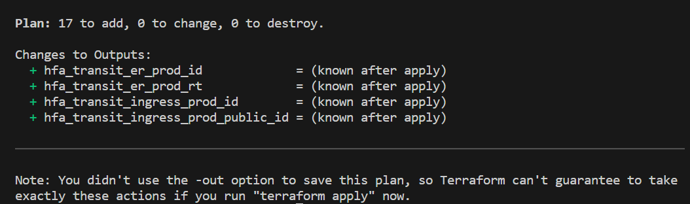
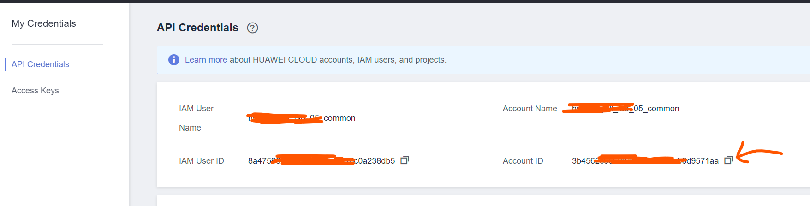
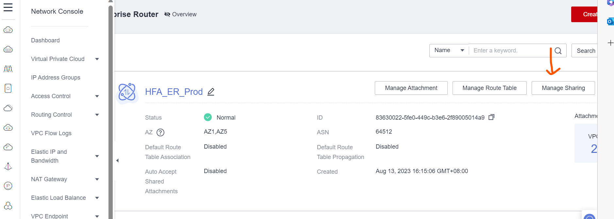
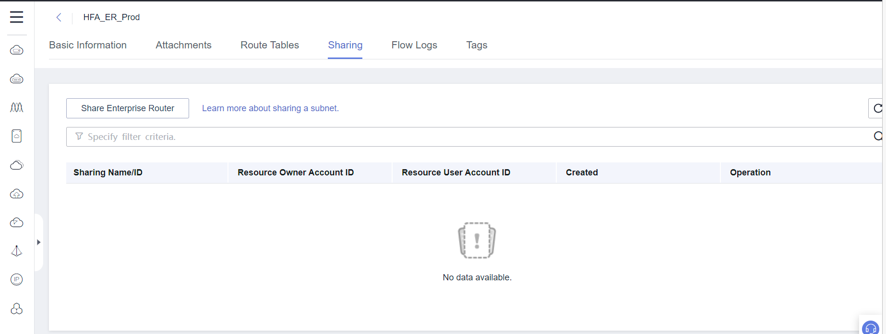
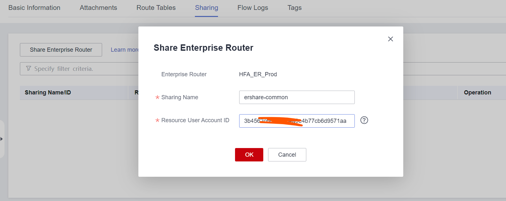
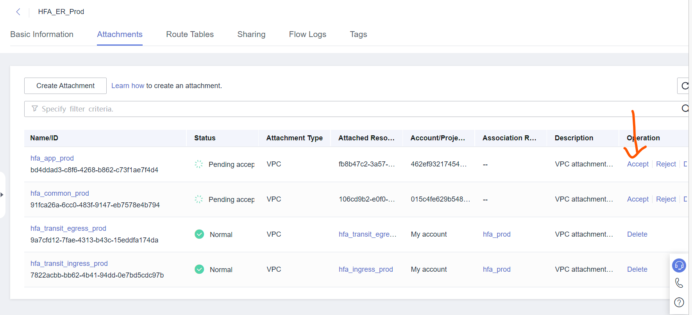
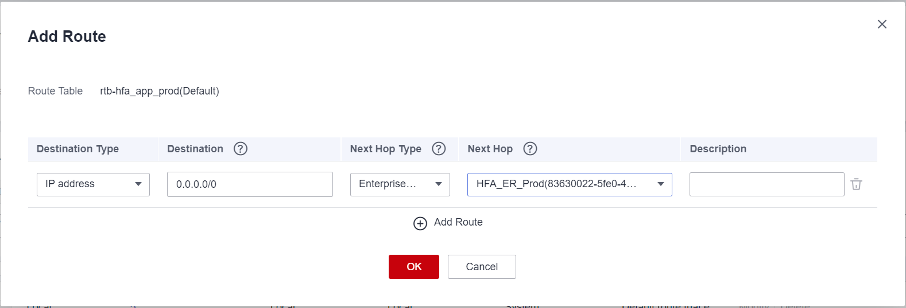

# Introduction
This module will responsible for creating all the network resources across different account.

# Tasks
## Configure Environment Variables
1. Change to `hfa/HFA-IAM` directory
2. Execute the following commands to get AK/SK for this module
```
terraform output hfa_iam_pipeline_network_ak
terraform output hfa_iam_pipeline_network_sk
```
`hfa_iam_pipeline_network_ak` and `hfa_iam_pipeline_network_sk` allow terraform to read/write terraform state file and make API call to Huawei Cloud to create network resources


3. Follow the instructions in  to configure both sets of environment variables.
The following figure use powershell as example


## Create Basic Network Resources
1. Change to  `hfa/HFA-Network` directory
2. Open `obs.tfbackend` file to configure terraform backend
3. Change the `bucket` and `key` parameters to the value that you designated in the `HFA-IAM` module
4. Open `terraform.tfvars` file to configure input variables
5. Change `hfa_terraform_state_bucket` and `hfa_iam_state_key` to match your environment, you can leave all the cidr as it is if you don't have specific requirements.
6. Execute the following commands to format terraform configuration and Initialize terraform
```
terraform fmt
terraform init -backend-config="obs.tfbackend"
```


7. Execute `terraform validate` to validate the correctness of the terraform configuration, you should get the following result:
```
Success! The configuration is valid
```

8. Execute `terraform plan` to generate a execution plan and view all the changes



9. Execute `terraform apply` to apply all the configuration to Huawei Cloud

10. Log in to the `Common Services Account` and `Production Account` separately
11. Click the username and select `My Credentials` from the drop-down list
12. Copy and save the `Account ID` for future use

13. Log in to the `Transit Account`
14. From `Service List`, choose `Enterprise Router`
15. On the ER page, click `Manage sharing` button

16. On the new page, click `Sahre Enterprise Router` and provide the saved account id to share ER with `Common Services Account` and `Production Account`


17. Copy `prod_app_account_vpc_1.tf` from `hfa/HFA-Network-phase-2`to `hfa/HFA-Network` directory
18. Execute `terraform apply` command
19. During `terraform apply`, you need to go back to `Transit Account` to accept the attachment, Terraform will failed otherwise

20. Log in to the `Common Services Account` and `Production Account` separately and set the default vpc route(0.0.0.0/0) to ER 


## Create Ingress Resources
1. Change to  `hfa/HFA-Network-Ingress` directory
2. Open `obs.tfbackend` file to configure terraform backend
3. Change the `bucket` and `key` parameters to the value that you designated in the `HFA-IAM` module
4. Open `terraform.tfvars` file to configure input variables
5. Change `hfa_terraform_state_bucket`, `hfa_iam_state_key` and `hfa_network_state_key ` to match your environment, you can leave all the cidr as it is if you don't have specific requirements.
6. Execute the following commands to format terraform configuration and Initialize terraform
```
terraform fmt
terraform init -backend-config="obs.tfbackend"
```
7. Execute `terraform validate` to validate the correctness of the terraform configuration, you should get the following result:
```
Success! The configuration is valid
```

8. Execute `terraform plan` to generate a execution plan and view all the changes
9. Execute `terraform apply` to apply all the configuration to Huawei Cloud