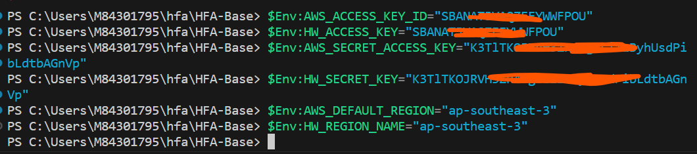

# Introduction
In this module, we will deploy a nginx server in `Production Account`

# Tasks
## Configure Environment Variables
1. Change to `hfa/HFA-IAM` directory
2. Execute the following commands to get AK/SK for this module(if you are in a team to apply this module, Please ask your team member who is responsible for HFA IAM Configuration to execute the following command and provide you the AK/SK)
```
terraform output hfa_iam_pipeline_app_ak
terraform output hfa_iam_pipeline_app_sk
```
`hfa_iam_pipeline_app_ak` and `hfa_iam_pipeline_app_sk` allow terraform to read/write terraform state file and make API call to Huawei Cloud to create network resources
3. Follow the instructions in [Loal Environment Setup](./03_Local_Env_Setup.md#configure-environment-variables) to configure both sets of environment variables.
The following figure use powershell as example


## Apply hfa/HFA-App Configuration
4. Change to  `hfa/HFA-App` directory
5. Open `obs.tfbackend` file to configure terraform backend
6. Change the `bucket` parameters to the name of the bucket that you created in the [Account Initialization](./02_Account_Initialization.md#create-a-obs-bucket-for-terraform-state-storage)
7. Open `terraform.tfvars` file to configure input variables
8. Change `hfa_terraform_state_bucket` and `hfa_iam_state_key` to match your environment, you can leave all the cidr as it is if you don't have specific requirements.
9. Execute the following commands to format terraform configuration and Initialize terraform
```
terraform fmt
terraform init -backend-config="obs.tfbackend"
```
10. Execute `terraform validate` to validate the correctness of the terraform configuration, you should get the following result:
```
Success! The configuration is valid
```

11. Execute `terraform plan` to generate a execution plan and view all the changes
12. Execute `terraform apply` to apply all the configuration to Huawei Cloud